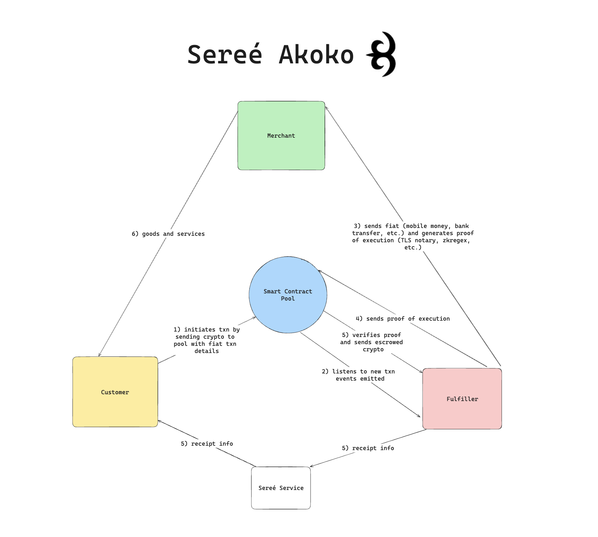

# Akoko

## What is Akoko?
Akoko is the blockchain protocol for the Sereé app. It escrows crypto and holds it until a fulfiller proves they've made a satisfying payment. 

## Project Diagram
Below is a diagram of Akoko. The Solidity protocol is the blue smart contract pool in the center. As you can see, there are more updates need (such as on-chain secp256r1 verification).



## Usage

### Build

```shell
$ forge build
```